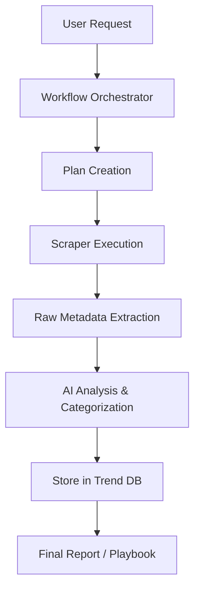

# 🕵️ Phase 2: The Discovery & Intelligence Layer

## 🎯 Goal
Turn raw internet data (TikTok, IG, Product Hunt or any newsletter and news site) into structured **Market Intelligence** that can be analyzed for replication opportunities.

---

## 🏗️ Design & Architecture

### 1. Data Collection Flow
1.  **Workflow Trigger**: User asks "What's trending in US Skincare?"
2.  **Strategy Phase**: Agent decides which platforms to scrape (e.g., TikTok + Reddit).
3.  **Execution Phase**: Agent uses (or creates) specialized scrapers from `utils/`.
4.  **Cleaning Phase**: Raw HTML/JSON is stripped and formatted.

### 2. The Scraper Framework (`utils/base_scraper.py`)
All scrapers must follow a standard interface:
- `scrape(url or query)` -> Returns raw data.
- `parse(raw_data)` -> Returns structured JSON.
- `save(data)` -> Persists to the temporary run folder.

### 3. Intelligence Engine (Processing)
Once data is collected, we need a **Knowledge Extractor**:
- **Inputs**: Scraped text, metadata, images.
- **Output**: 
  - `Company Name`
  - `Unique Selling Prop (USP)`
  - `Monetization Model`
  - `Growth Signal (e.g., "1M views in 24h")`

---

## 🔁 Workflow Design

---

## 📊 Database Schema (Preliminary)

We will use a local SQLite database (`data/mie_vault.db`) to store our core findings.

| Table | Columns |
|-------|---------|
| `Trends` | `id`, `platform`, `topic`, `viral_score`, `timestamp` |
| `Companies` | `id`, `name`, `origin_country`, `model_type`, `description` |
| `MarketGaps` | `id`, `company_id`, `target_market`, `viability_score` |

---

## 🚀 Key Milestones
1.  **Framework Standard**: Define `BaseScraper`.
2.  **Real Scrapers**: Implement first working scrapers for TikTok/ProductHunt.
3.  **Processing Layer**: Integrate AI extraction for business model identification.
4.  **Persistence**: Implement the SQLite storage layer.
